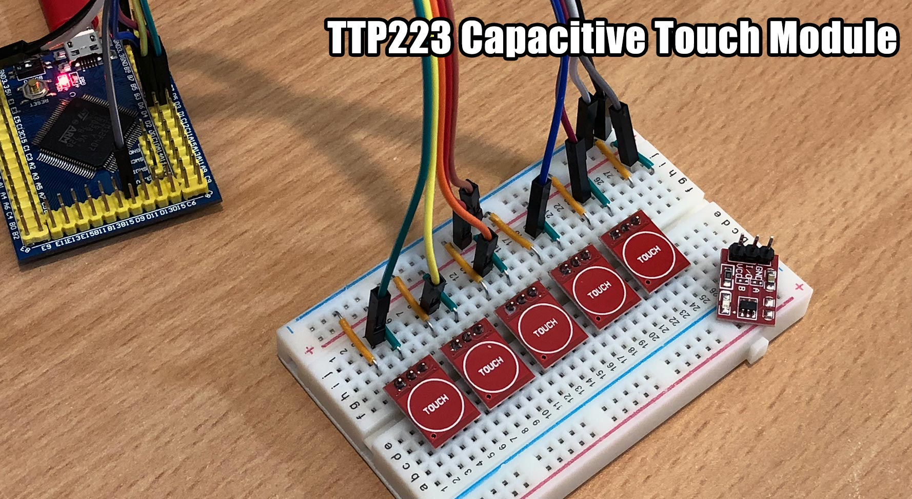

# MicroPython TTP223

Using a TTP223 1-key capacitive touch module with MicroPython.

I was going to write a driver for this module, but it's pretty much just a drop in replacement for a push button. No driver needed.

The module features 3 pins, VCC, I/O and GND and has a red LED which illuminates when a touch is detected and the I/O pin goes HIGH.

It's sensitive enough to detect my finger around 3mm away from the touch pad.



#### Examples

**Basic usage**

```python
from machine import Pin
import time

d3 = Pin('D3', Pin.IN, Pin.PULL_DOWN)

while True:
    print(d3.value())
    time.sleep_ms(100)
```

**Using interrupts**

```python
from machine import Pin

d3 = Pin('D3', Pin.IN, Pin.PULL_DOWN)
d4 = Pin('D4', Pin.IN, Pin.PULL_DOWN)

def touch(pin):
    print('Touched {}'.format(pin.name()))

d3.irq(touch, Pin.IRQ_FALLING)
d4.irq(touch, Pin.IRQ_FALLING)
```

## Parts

* [VCC-GND STM32F407VET6 mini](https://www.aliexpress.com/item/STM32F407VET6-Mini-version-of-the-core-board-STM32-minimum-system-version/32709285751.html) $15.47 AUD
* [TTP223 Capacitive Touch Module](https://www.aliexpress.com/item/5PCS-LOT-NEW-TTP223-Touch-button-Module-Capacitor-type-Single-Channel-Self-Locking-Touch-switch-sensor/32416625219.html) $0.22 AUD
* [Female-Female Dupont wires](https://www.aliexpress.com/item/10pcs-10cm-2-54mm-1p-1p-Pin-Male-to-Male-Color-Breadboard-Cable-Jump-Wire-Jumper/32636873838.html) $0.64 AUD

## Connections

STM32F407VET6 | TTP223 Capacitive Touch Module
------------- | -----------------
3V3 (or 5V)   | VCC
D3 (any pin)  | I/O
GND           | GND

## Links

* [micropython.org](http://micropython.org)
* [TTP223 datasheet](https://infusionsystems.com/support/TTP223.pdf)
